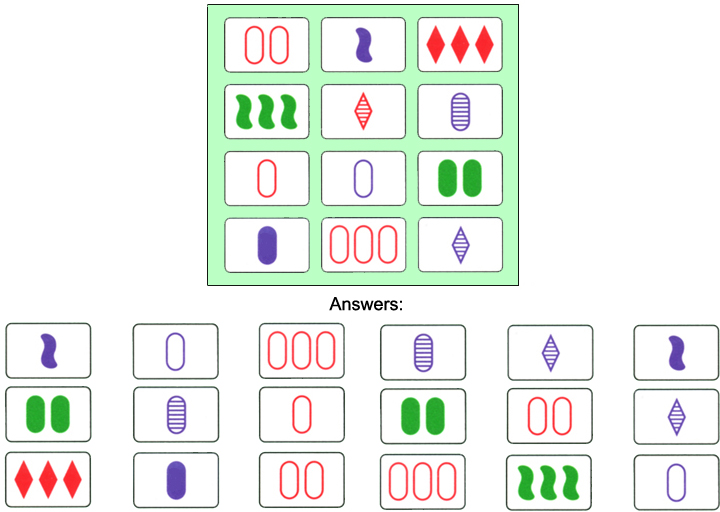
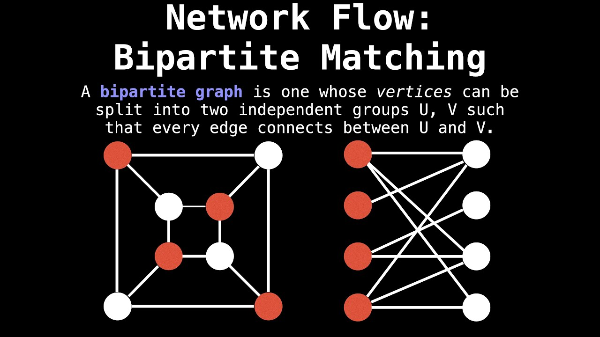
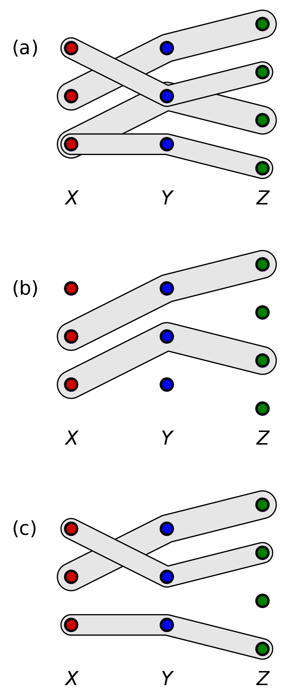

# Set Card Game Complexity and Solver with IP

The Set card game was released in 1991[^1], and has been studied extensively by mathmaticians over the last several decades for its unique combinatorial properties. In this writeup, we will highlight some of these results and provide example code for finding valid Sets. 

# What is Set? 
The traditional version of Set involves a deck of 81 cards. Each card has 4 properties (color, shape, shading, number) and each property has 3 versions. This create a total of $3^4 = 81$ cards in the deck. A "valid Set" involves a pair of 3 cards that for each property have either all the same value or all different values. Players play the game by dealing 12 cards face up and simultaneously look for valid Sets. When a player finds a valid set, they remove the set from board and 3 more cards are dealt to replace them. The game ends when there are no more valid Sets left or all cards have been exausted. A player wins the game if they have found more valid Sets than their opposition. 

  

 
An example set board with n=12 cards, p=4 properties, and v=3 values.[^2] We will continue to use the notation {n, p, v} for the generalized parameters of Set because they are intuitive. Some papers use different notation such as {m, n, k} as a matter of preference. 

# What is Multidimensional Matching
To analyze the complexity of finding valid Sets, we will be using a reduction from multidimensional matching that has been studied for the card game Set before. 

  

An example picture of a bipartite matching [^5].

The 2-dimension case is known as bipartite matching. In this case, vertices of a graph are partitioned into two disjoint sets with edges connecting them. A matching is a set of edges that cover each vertex at most once. A maximum matching is identical to a min-cost edge cover. It's trivial to solve bipartite matching in polytime using a max-flow algorithm. To do so, one of the disjoint sets is connected to the source (with inf capacity) and the other disjoint set is connected to the target/sink (with inf capacity). All original edges are left at capacity one.

  

An example of 3-dimensional matching [^6].

In k-dimensions where $k \ge 3$, hypergraphs contain hyperedges that each connect k-vertices. Figure a above shows an example input graph with $k = 3$. The figures b and c show examples of valid matchings. 

3-dimensional matching is one of Karps 21 NP-complete problems published in 1972 [^7].

# Reducing Multi-Dimensional Matching to Set
Below is an explanation of approaches from Chaudhuri et al. [^8] and Lampis et al. [^9]. We want to show that finding valid Sets is NP-complete and that no efficient algorithm exists for doing so in the generalized case. In the later section, we will show how one can implement an algorithm for finding valid Sets by using the python MIP (mixed-integer-programming) library and a binary integer program (IP) formulation.

Consider a board of n cards with p properties and v values. Take a hypergraph which contains $p*v$ total vertices. Represent every card from the board as a hyperedge connecting every vertex that has a matching property/value pair. 

Lampis notes that a perfect matching of the hypergraph must be a valid Set. The reason for this is that a perfect matching makes sure that for every property from the cards (hyperedges) selected, all values must be different. If this was not the case, then some hyperedges would overlap vertices and not be a perfect matching.

However, because valid Sets can also contain cards with properties of all the same value, not all perfect matching of the hypergraph are valid Sets. 

# Solver for valid Set with IP Formulation
Below is a generalization of the approach taken in the following source [^4] to formulate finding a valid Set with arbitrary N (cards on board), P (number of card parameters), and V (number of values for each parameter). 

<strong>*Given*</strong>

We are given the board (b) as an input. Let b[i] represent a given card such that b[i][p][v] tells us if a given value is on the card for a given parameter. For example: a "green two symbol squigle with no fill" might look like this: 

| param (p) | value 0 | value 1  | value 2 |
| ------------- | ------------- | ------------- | ------------- | 
| Color     |0 (not red) |0 (not purple)|1 (is green)|
| Number    |0 (not one symbol)|1 (has two symbols)|0 (not three symbol)|
| Shape     |0 (not oval)|0 (not diamond)|1 (has a squigle)|
| Fill      |1 (has no fill)|0 (is not shaded)|0 (is not solid)|

$$ 
N, P, V \in \mathbb{N}
$$

$$ 
b_{i,p,v} \in \{0,1\} \ \ \ \ \forall i=0...N, \forall p=0...P, \forall v=0...V
$$

<strong>*Subject To (Descision Variable Constraints)*</strong>

We have exactly enough cards to form a valid Set

$$
\sum_{i=0}^{i=N} inc[i] = V
$$

For every parameter, compute how many chosen cards have a given value

$$ 
vsum_{p,v} = \sum_{i=0}^{i=N} \sum_{v=0}^{v=V} (inc[i] * b[i][p][v]) \ \ \ \  \forall { p,v }
$$

Let z[p][v] represent which value is going to be the same for a given parameter. If all values are different, then z[p][v] should be 0 for all v. Let the variable y[p] allow branching on these two cases. If y[p] is true then all values are different for a given parameter. Otherwise, all values should be the same for a given parameter. 

$$
\sum_{v=0}^{v=V} z[p][v] = 1 - y[p] \ \ \ \ \forall p=0...P 
$$

Now, use the the variable z and computed vsums parameter to make sure that we have a valid Set. 

$$
\sum_{v=0}^{v=V} vsum[p][v] = y[p] + P * z[p][v] \ \ \ \ \forall p=0...P
$$

<strong>*Subject To (Descision Variable Definitions)*</strong>

$$
inc_{i} \in \{0,1\}  \ \ \ \  \forall i=0...N
$$

$$ 
z_{p,v} \in \{0,1\}  \ \ \ \ \forall p=0...P, \forall v=0...V
$$

$$ 
y_{p} \in \{0,1\}  \ \ \ \ \forall p=0...P
$$

# Sidenote: Relation to Linear Algebra and Finite Fields
The cannonical version of Set with p=4 properties and v=3 values has an interesting property when represented as a finite field. If you represent each card as a vector in $F^4_3$ with the following encoding: [^3]

| Color  | Number | Shape  | Fill |
| ------------- | ------------- | ------------- | ------------- |
| 0 = Red | 0 = 1 symbol  | 0 = oval  | 0 = No fill  |
| 1 = Purple  | 1 = 2 symbols  | 1 = diamonds  | 1 = Shaded   |
| 2 = Green  | 2 = 3 symbols  | 2 = squigle  | 2 = Solid  |

a set can be shown to always form a line with modular wrap-around. 

# Sidenote: Minimum cards to deal before valid Set
# Sidenote: 2-card one-compliment rule 

# References
[^1]: https://www.setgame.com/sites/default/files/instructions/SET%20INSTRUCTIONS%20-%20ENGLISH.pdf
[^2]: https://www.exodusbooks.com/set-game/9097/
[^3]: https://www.math.ucdavis.edu/~anne/FQ2014/set_game.pdf
[^4]: https://tommyodland.com/articles/2019/the-card-game-set-as-a-binary-integer-program/
[^5]: https://www.youtube.com/watch?v=GhjwOiJ4SqU
[^6]: https://en.wikipedia.org/wiki/3-dimensional_matching#/media/File:3-dimensional-matching.svg
[^7]: https://en.wikipedia.org/wiki/Karp%27s_21_NP-complete_problems#CITEREFKarp1972
[^8]: http://pbg.cs.illinois.edu/papers/set.pdf
[^9]: https://www.irif.fr/~vmitsou/setgame.pdf